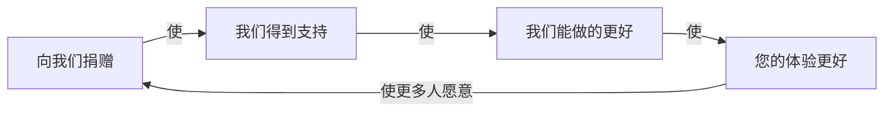

# Codemao API

> 编程猫社区 API 文档

## 概述
Codemao API 是由编程猫社区用户[简单得不简单](https://shequ.codemao.cn/user/2776410)发布及维护的，旨在为广大训练师提供快速上手的社区API接口文档，使用时请注意：

- 所有API的地址都基于这个URL：`https://api.codemao.cn`
- 大部分API介绍出于隐私等原因，不提供请求示例，请自行尝试

## 特征
- 易于学习，解释清晰，小白也可以快速上手
- 更新速度快，随时适配接口的最新状态
- ......

## 捐赠
如果您认为 Codemao API 对您有帮助或我的工作很有价值，请考虑捐赠。

## 加入我们
如果你想参与本文档的开发与维护，请[发送邮件](mailto:jddbjd@qq.com)到`jddbjd@qq.com`，目前，已经有以下开发者加入：
- [简单得不简单](https://shequ.codemao.cn/user/2776410)

## 问题反馈
尽管我们尽力做到最好，但仍然存在许多改进之处：
- 许多地方标注了`未知`
- 可能遗漏掉了某些 API
- 文档本身可能存在一些错误

您的任何宝贵意见都可以通过[邮件](mailto:jddbjd@qq.com)反馈
